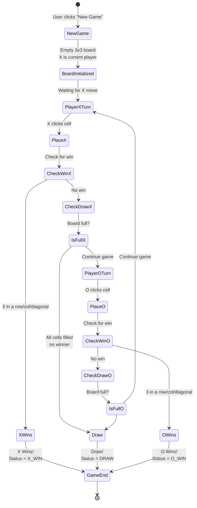

# XO Game - Mermaid Diagrams

## 1. System Architecture

```mermaid
graph TB
    subgraph Frontend["Frontend Layer"]
        UI["HTML/CSS/JavaScript UI<br/>3x3 Grid Board"]
        Events["Click Events<br/>New Game Button"]
    end
    
    subgraph Backend["Google Apps Script Backend"]
        Logic["Game Logic<br/>- Win Detection<br/>- Draw Detection<br/>- Turn Management"]
        API["Google Sheets API<br/>Read/Write Board State"]
    end
    
    subgraph Database["Google Sheets Database"]
        GameBoard["GameBoard Sheet<br/>- Board State<br/>- Current Player<br/>- Game Status"]
    end
    
    subgraph Deployment["Deployment"]
        WebApp["Google Apps Script<br/>Web App URL"]
    end
    
    UI -->|Player moves| Events
    Events -->|POST requests<br/>makeMove()| Logic
    Logic -->|Check game state<br/>Apply game rules| API
    API -->|Read/Write<br/>game data| GameBoard
    GameBoard -->|Return state| API
    API -->|Updated board| Logic
    Logic -->|JSON response| UI
    UI -->|Display board<br/>& status| WebApp
    WebApp -->|Serve app| Events
```

Shows the complete flow from user interaction → frontend → backend logic → Google Sheets database → web app deployment. The frontend communicates with Google Apps Script backend via POST requests, which validates moves and syncs data to Google Sheets.

---

## 2. Game State Flow



Illustrates the game lifecycle from initialization through player moves, win/draw detection, and game completion. Shows how the game alternates between X and O turns and handles all terminal states (X wins, O wins, Draw).

---

## 3. Test Coverage - 11 Test Cases Flow

```mermaid
graph LR
    subgraph Initialization["Initialization"]
        T1["New Game<br/>Initialize Board"]
    end
    
    subgraph BasicMovement["Basic Movement"]
        T2["X Makes Move"]
        T3["O Makes Move"]
        T4["Occupied Cell<br/>Rejection"]
    end
    
    subgraph WinConditions["Win Conditions"]
        T5["Row Win<br/>3-in-a-row"]
        T6["Column Win<br/>3-in-a-column"]
        T7["Diagonal Win<br/>3-in-diagonal"]
    end
    
    subgraph DrawCondition["Draw Condition"]
        T8["Draw Detection<br/>Full Board"]
    end
    
    subgraph Reset["Reset"]
        T9["New Game Reset"]
    end
    
    subgraph Persistence["Persistence"]
        T10["Browser Refresh"]
        T11["Sheet Data Integrity"]
    end
    
    T1 --> T2
    T2 --> T3
    T3 --> T4
    T4 --> T5
    T5 --> T6
    T6 --> T7
    T7 --> T8
    T8 --> T9
    T9 --> T10
    T10 --> T11
    
    style Initialization fill:#e1f5ff
    style BasicMovement fill:#fff3e0
    style WinConditions fill:#f3e5f5
    style DrawCondition fill:#e8f5e9
    style Reset fill:#fce4ec
    style Persistence fill:#f1f8e9
```



Organizes all 11 test cases into 6 logical categories:
- **Initialization** (1 test)
- **Basic Movement** (3 tests)
- **Win Conditions** (3 tests)
- **Draw Condition** (1 test)
- **Reset** (1 test)
- **Persistence** (2 tests)
